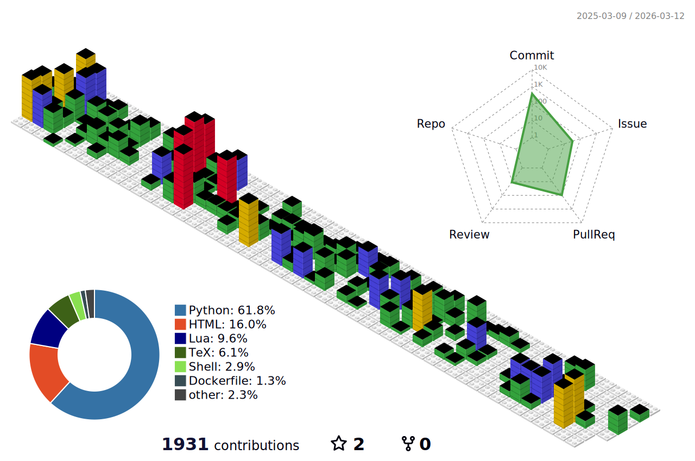

I am currently a hpc research solutions architect at Southern Methodist University, where I work on a variety of research projects and provide general HPC support.

Broadly speaking, my interest are in applying mathematical techniques and high performance scientific computing to a variety of interesting problems.

[lagrone.me](https://www.lagrone.me)

